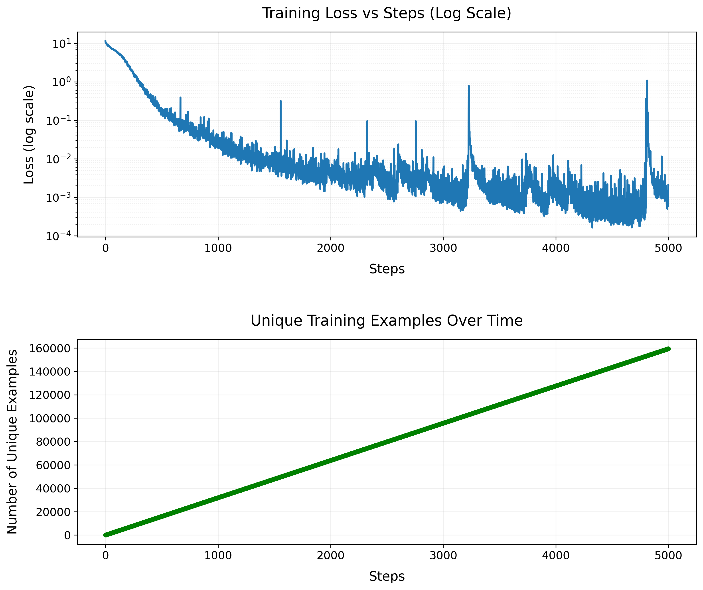

# SmolLM2: Implementation from the ground up

This repository contains a PyTorch implementation of the SmolLM2 language model, a compact transformer-based model with grouped-query attention, designed for efficient natural language processing. Built from the ground up through reverse engineering, this implementation closely follows the architecture described in the model's Hugging Face specifications, primarily based on the model's Hugging Face model card (hf_model.md) and configuration files (config_smollm2_135M.yaml). It provides a clear, documented codebase for learning and experimentation.

### Training Details

The model was initially trained for 5000 steps with a batch size of 32. After reaching this milestone, an additional 50 steps of training were performed to ensure model stability and convergence.

**Two-Phase Training Approach**

1. **Main Training Phase (5000 steps)**
   - Trained with standard learning rate and optimization parameters
   - Model and metrics saved at regular checkpoints (every 500 steps)
   - Final model saved as `smollm2_model_final`

2. **Additional Training Phase (50 steps)**
   - Loaded the final checkpoint from main phase
   - Performed fine-tuning with 50 additional steps
   - Loss values remained stable (ranging between 0.0004-0.0022)
   - Helped verify model stability and convergence

This two-phase approach helped validate that the model reached a stable training state, with consistently low loss values during the additional training steps. The stable loss metrics in the second phase (averaging around 0.0007) indicate successful model convergence.

### [Hugging Face Demo Link](https://huggingface.co/spaces/dhairyashil/SmolLM2_GroundUp)
The model here was trained for 5000 steps on a 135M parameter model with a batch size of 32.

## Model Architecture

The model follows a decoder-only transformer architecture with the following specifications:

- **Model Size**: 135M parameters
- **Hidden Size**: 576 dimensions
- **Layers**: 30 transformer blocks
- **Attention Heads**: 9 query heads, 3 key/value heads (3x grouped-query attention)
- **Intermediate Size**: 1536 dimensions (MLP expansion factor of 2.67x)
- **Maximum Sequence Length**: 8192 tokens
- **Vocabulary Size**: 49,152 tokens

### Model Summary

```bash
SmolLM2ForCausalLM(
  (model): SmolLM2Model(
    (embed_tokens): Embedding(49152, 576)
    (layers): ModuleList(
      (0-29): 30 x SmolLM2Block(
        (input_layernorm): RMSNorm()
        (attention): SmolLM2Attention(
          (q_proj): Linear(in_features=576, out_features=576, bias=False)
          (k_proj): Linear(in_features=576, out_features=192, bias=False)
          (v_proj): Linear(in_features=576, out_features=192, bias=False)
          (o_proj): Linear(in_features=576, out_features=576, bias=False)
        )
        (post_attention_layernorm): RMSNorm()
        (mlp): SmolLM2MLP(
          (gate_proj): Linear(in_features=576, out_features=1536, bias=False)
          (up_proj): Linear(in_features=576, out_features=1536, bias=False)
          (down_proj): Linear(in_features=1536, out_features=576, bias=False)
          (act_fn): SiLU()
        )
      )
    )
    (norm): RMSNorm()
  )
  (lm_head): Linear(in_features=576, out_features=49152, bias=False)
)
Model parameters: 134515008
```

### Traning Metrics
The training progress is visualized through two key metrics:

1. **Training Loss (Log Scale)**: Shows the model's learning curve over training steps. The logarithmic scale helps visualize the rapid initial descent.

2. **Unique Examples**: Tracks the number of distinct training examples seen by the model. A steady increase indicates good data diversity, while plateaus might suggest data repetition. Each point (green dots) represents a measurement during training.



The final model achieved a loss of 0.0009 after seeing 156214 unique examples over 5000 training steps.

### Key Components

- **Attention Mechanism**: 
  - Implements grouped-query attention (GQA) for efficiency
  - Uses rotary positional embeddings (RoPE)
  - No attention biases (bias=False in all attention projections)
  - Supports optional attention dropout

- **Feed-Forward Network**:
  - SiLU activation function
  - No bias terms in linear projections
  - Parallel gate and up-projections followed by down-projection

- **Normalization**:
  - RMSNorm (Root Mean Square Normalization)
  - Epsilon value of 1e-5
  - Applied pre-attention and pre-FFN

## Training Setup

The training implementation includes:

- **Optimizer**: AdamW with learning rate 3e-4
- **Batch Size**: 32 sequences per batch
- **Sequence Length**: 512 tokens
- **Gradient Clipping**: 1.0 max norm
- **Learning Rate Schedule**: 
  - Linear warmup over first 100 steps
  - Constant learning rate after warmup
- **Dataset**: Streams from HuggingFaceTB/smollm-corpus (cosmopedia-v2)
- **Tokenizer**: HuggingFaceTB/cosmo2-tokenizer

### Training Features

- Automatic device selection (CUDA/MPS/CPU)
- Streaming dataset implementation for memory efficiency
- Periodic checkpointing and model saving
- Training metrics logging and visualization
- Text generation samples during training
- Support for training interruption and resumption

## Generation

The model supports text generation with the following features:

- Temperature-controlled sampling
- Top-k sampling (default k=40)
- Special token filtering
- Configurable maximum generation length
- Support for custom prompts

## Repository Structure

```
smollm2_ground_up/
├── model.py          # Core model architecture implementation
├── train.py         # Training loop and data handling
├── plot_metrics.py  # Training visualization tools
├── demo.py          # Model demonstration script
└── config/
    └── config_smollm2_135M.yaml  # Model configuration
```

## Usage

To train the model:

```bash
export HF_TOKEN=your_token_here
python train.py
```

The training script will:
1. Initialize model and load tokenizer
2. Set up streaming dataset
3. Begin training with periodic evaluation
4. Save checkpoints and metrics
5. Generate sample texts during training

## Implementation Notes

While this implementation aims to closely match the original SmolLM2, there are some implementation choices worth noting:

- RoPE implementation uses complex number operations for rotation
- Attention computation leverages PyTorch's scaled_dot_product_attention when available
- Streaming dataset implementation for efficient training on large datasets
- Comprehensive metrics tracking and visualization

## Requirements

- PyTorch
- Transformers
- Datasets
- tqdm
- matplotlib (for visualization)

## References

This implementation is based on the architecture of SmolLM2 by HuggingFaceTB. The implementation details were derived through careful study of the model's public specifications and architecture.
